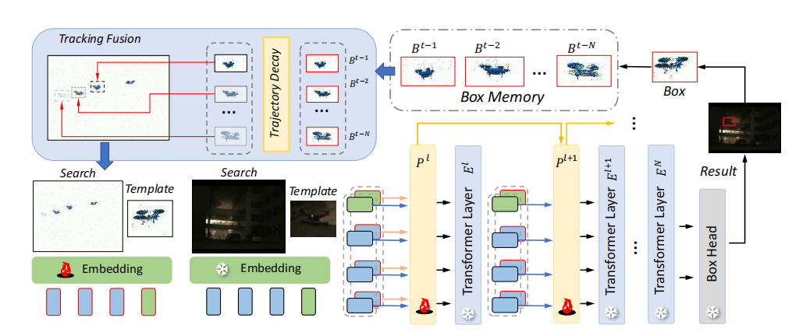
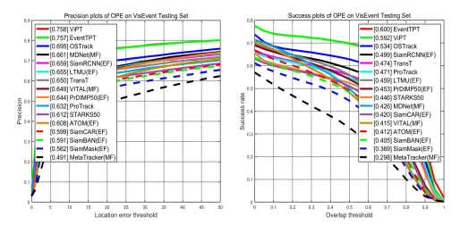
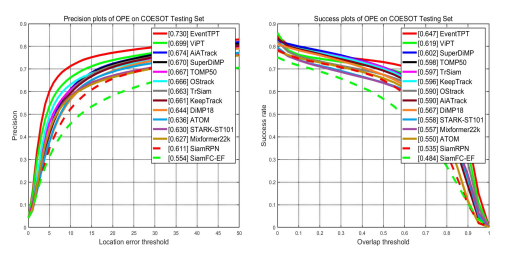
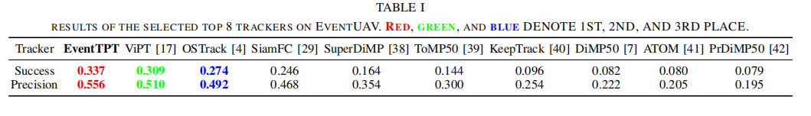
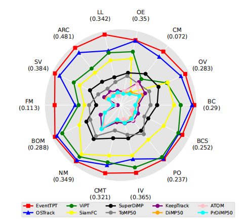

# EventTPT [ICRA25]

The official implementation for the **ICRA2025** paper [Towards Survivability in Complex Motion Scenarios: RGB-Event
Object Tracking via Historical Trajectory Prompting].

[Models & Raw Results](https://pan.baidu.com/s/1iBbcpJHI4FzdknaU3Do5qw?pwd=8war)
Baidu Driver: 8war

[EventUAV datasets](https://pan.baidu.com/s/1fmCMLANsXep26DS5yWe7mQ?pwd=1121)
Baidu Driver: 1121


## News
**[Feb 14, 2025]**
- We release codes, models and raw results. 

**[Jan 28, 2025]**

- EventTPT is accepted to ICRA2025.

## Introduction
- We contribute a RGB-Event tracking benchmark named EventUAV for tracking objects with complex motion trajectories. 

- We present EventTPT, a novel RGB-Event tracking framework for challenging scenarios.

- We expect EventTPT to be a resilient vision system for robotic applications.

<center></center>

## Results
### On VisEvent benchmark
<center></center>

### On COESOT benchmark
<center></center>

### On EventUAV benchmark
<center></center>
<center></center>

## Presentation Demo
[](https://www.youtube.com/watch?v=zCImkIVw4Lg "")
## Usage
### Installation
Create and activate a conda environment:
```
conda create -n EventTPT python=3.7
conda activate EventTPT
```
Install the required packages:
```
bash install_EventTPT.sh
```

### Data Preparation
Put the training datasets in ./data/. It should look like:
```
$<PATH_of_ViPT>
-- data
    -- EventUAV
        |-- 1
        |-- 2
        |-- 3
        ...
    -- COESOT
        |-- Training Subset
            |-- dvSave-2021_09_01_06_59_10
            ...
    -- VisEvent/train
        |-- 00142_tank_outdoor2
        |-- 00143_tank_outdoor2
        ...
        |-- trainlist.txt
```

### Path Setting
Run the following command to set paths:
```
cd <PATH_of_ViPT>
python tracking/create_default_local_file.py --workspace_dir . --data_dir ./data --save_dir ./output
```
You can also modify paths by these two files:
```
./lib/train/admin/local.py  # paths for training
./lib/test/evaluation/local.py  # paths for testing
```

### Training
Dowmload the pretrained [foundation model](https://drive.google.com/drive/folders/1ttafo0O5S9DXK2PX0YqPvPrQ-HWJjhSy?usp=sharing) (OSTrack) 
and put it under ./pretrained/.
```
bash train_EventTPT.sh
```
You can train models with various modalities and variants by modifying ```train_vipt.sh```.

### Testing

#### For RGB-E benchmark
[VisEvent]\
Modify the <DATASET_PATH> and <SAVE_PATH> in```./RGBE_workspace/test_rgbe_mgpus.py```, then run:
```
bash eval_rgbe.sh
```
We refer you to [VisEvent_SOT_Benchmark](https://github.com/wangxiao5791509/VisEvent_SOT_Benchmark) for evaluation.

[COESOT]\
Modify the <DATASET_PATH> and <SAVE_PATH> in```./RGBE_workspace/test_rgbe_mgpus.py```, then run:
```
bash eval_rgbe.sh
```
We refer you to [COESOT_SOT_Benchmark](https://github.com/Event-AHU/COESOT) for evaluation.

[EventUAV]\
Modify the <DATASET_PATH> and <SAVE_PATH> in```./RGBE_workspace/test_rgbe_mgpus.py```, then run:
```
bash eval_rgbe.sh
```


## Bixtex
If you find EventTPT is helpful for your research, please consider citing:

```bibtex
@inproceedings{EventTPT,
  title={Towards Survivability in Complex Motion Scenarios: RGB-Event Object Tracking via Historical Trajectory Prompting},
  author={Wenhao Xia,Jiawen Zhu,Zihao Huang,Jinqing Qi,You He,Xu Jia},
  booktitle={ICRA},
  year={2025}
}
```

## Acknowledgment
- This repo is based on [ViPT](https://github.com/jiawen-zhu/ViPT) which is an excellent work.
- We thank for the [PyTracking](https://github.com/visionml/pytracking) library, which helps us to quickly implement our ideas.

## Contact
If you have any question, feel free to email 8744696101@mail.dlut.edu.cn. 


